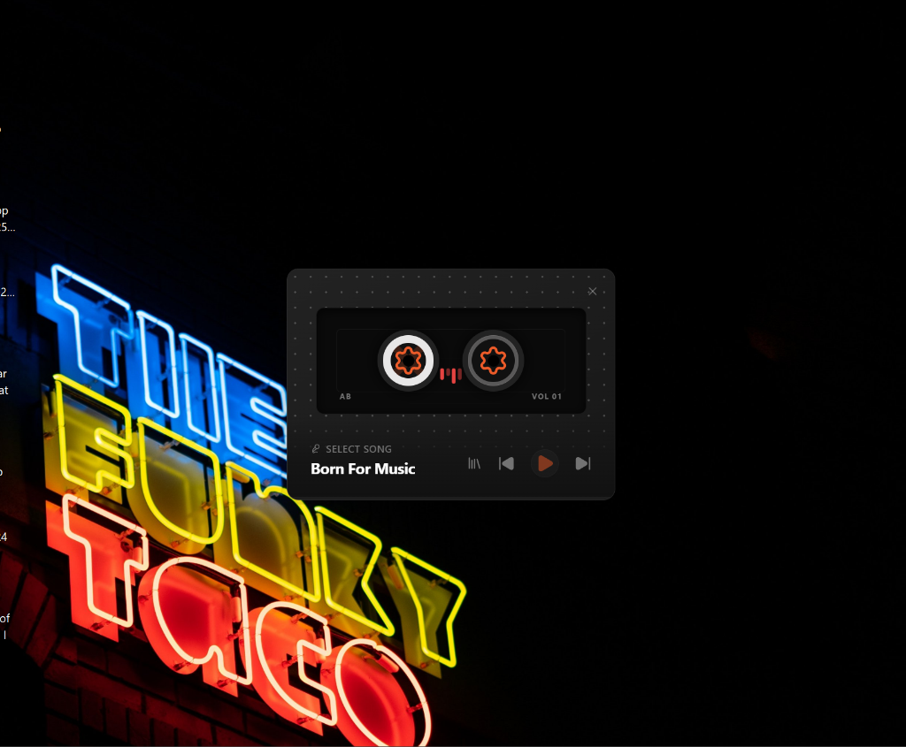
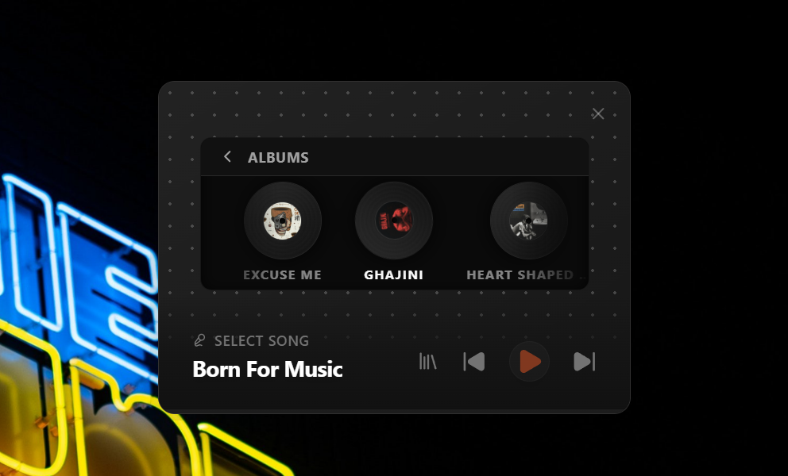

# sideTrack 🎵

> **A retro-futuristic music player built for those who love the aesthetics of the past with the power of the present.**


---

## ✨ Overview

**sideTrack** is not just a music player; it's an experience. Designed with a deep appreciation for the tactile feel of analog media, it brings back the joy of cassette tapes and vinyl records, wrapped in a sleek, dark-mode neon interface.

Whether you're listening to your favorite lo-fi beats or dedicated tracks, sideTrack immerses you in a visual journey.

---

## 📸 Gallery

<p align="center">
  
  &nbsp; &nbsp; &nbsp;
  
</p>

---

## 🚀 Features

- **📼 Dynamic Cassette UI**: Watch the reels spin as your music plays. A fully animated, interactive cassette experience.
- **💿 Vinyl Album Selector**: Browse your collection with a 3D-style vinyl record carousel.
- **❤️ Love Screen**: A dedicated space for special songs and messages (Easter Egg included!).
- **🌑 Neon Dark Mode**: A carefully crafted UI that pops on your screen without straining your eyes.
- **📂 Smart Library**: Easily manage your offline music collection. Scan, refresh, and clean your library with ease.
- **🔊 High-Quality Audio**: Built on `mpv` for robust and high-fidelity text-to-speech and audio playback.

---

## 🛠️ Built With

- **Electron**: For a seamless cross-platform desktop experience.
- **React 19**: Powered by the latest React features for a responsive UI.
- **Vite**: Blazing fast build tool and development server.
- **TailwindCSS**: For rapid and beautiful styling.
- **SQLite**: Robust local database for managing your music library.

---

## 📥 Getting Started

To build and run sideTrack locally:

```bash
# Clone the repository
git clone https://github.com/yourusername/sidetrack.git

# Navigate into the project directory
cd sidetrack

# Install dependencies
npm install

# Start the development server
npm start
```

### Building for Production

To create a Windows installer:

```bash
npm run build
```

---

## 👨‍💻 Author

**Abhyan Bansal**

---

Made with ❤️ and 🎵 using Electron.
